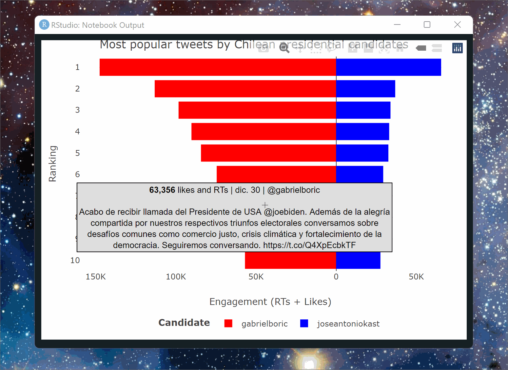

# rtweet_boric_kast

This is an ~~ongoing~~ attempt to use `rtweet`, `plotly` and `crosstalk` to create an interactive visualization of the tweets with more engagement from Chilean latest presidential candidates (J.A. Kast and Gabriel Boric).

**UPDATE (2022-03-11):** I'm pivoting this project towards building a weekly tracker of the tweets with most engagement from the [155 Chilean conventional constituents that are drafting the new Chilean constitution](https://en.wikipedia.org/wiki/Constitutional_Convention_(Chile)). This repo is no longer updated, and the new project lives in [franciscoyira/shiny_tracker_constituyentes](https://github.com/franciscoyira/shiny_tracking_constituyentes).

*Work in progress...*
